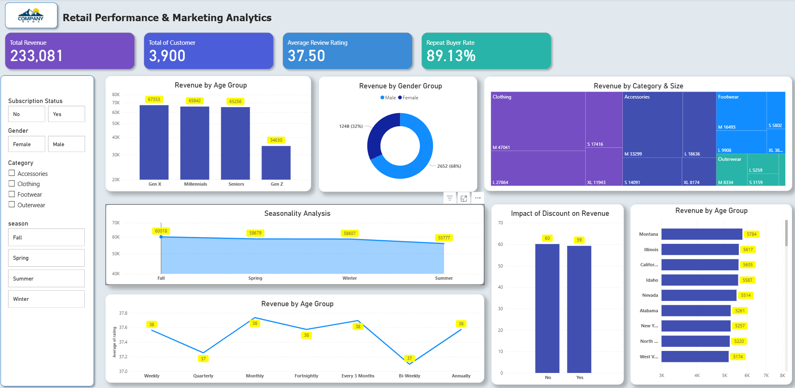

# Consumer Shopping Behavior & Marketing Strategy Analysis

## 📊 Dashboard Preview


## 📌 Project Overview
Proyek ini bertujuan untuk menganalisis perilaku belanja pelanggan pada sebuah perusahaan retail terkemuka guna meningkatkan penjualan, kepuasan pelanggan, dan loyalitas jangka panjang. Melalui analisis ini, kita akan mengungkap bagaimana faktor-faktor seperti demografi, kategori produk, saluran penjualan, dan promosi memengaruhi keputusan pembelian.

## ❓ Business Problem
Pihak manajemen mencatat adanya perubahan pola pembelian di berbagai segmen. Pertanyaan bisnis utama yang dijawab dalam proyek ini adalah:
> **"Bagaimana perusahaan dapat memanfaatkan data belanja konsumen untuk mengidentifikasi tren, meningkatkan keterlibatan pelanggan, serta mengoptimalkan strategi pemasaran dan produk?"**

## 🎯 Project Objectives
* **Identifikasi Tren:** Memahami pola pembelian berdasarkan demografi dan musim.
* **Analisis Saluran:** Membandingkan efektivitas penjualan antara saluran *online* dan *offline*.
* **Driver Keputusan:** Menentukan faktor kunci (diskon, ulasan, metode pembayaran) yang mendorong pembelian berulang (*repeat purchase*).
* **Rekomendasi Strategis:** Memberikan usulan berbasis data untuk optimasi strategi pemasaran.

## 🛠️ Tech Stack & Deliverables
Sesuai dengan kebutuhan proyek, analisis ini mencakup:
1. **Data Preparation & Modeling (Python):** Pembersihan data mentah, penanganan *missing values*, dan transformasi data agar siap dianalisis.
2. **Data Analysis (SQL):** Pengorganisasian data terstruktur dan eksekusi query untuk mengekstrak wawasan terkait segmen pelanggan dan loyalitas.
3. **Visualization & Insights (Power BI):** Pembuatan dashboard interaktif untuk visualisasi tren kunci bagi para pemangku kepentingan.
4. **Actionable Insights:** Laporan akhir berisi temuan utama dan rekomendasi bisnis.

## 📂 Repository Structure
```text
├── data/                   # Raw & Cleaned Dataset (CSV/XLSX)
├── scripts/
│   ├── data_cleaning.ipynb # Python: Data Preparation & Modeling
│   └── analysis_queries.sql # SQL: Data Analysis & Insights
├── dashboard/              # Power BI (.pbix) or Dashboard Screenshots
├── reports/                # Project Summary & Presentation
└── README.md               # Project Documentation

## 🚀 Panduan Pengembangan Antar Perangkat (PC Rumah/Kantor/Laptop)

Gunakan panduan ini untuk memastikan lingkungan kerja kamu selalu sinkron dan tidak ada error tipe data saat berpindah perangkat.

### 1. Prasyarat Sistem
Pastikan alat berikut sudah terinstal di setiap PC yang kamu gunakan:
* **Git**: [Unduh di sini](https://git-scm.com/)
* **uv** (Python Manager): Jalankan perintah ini di PowerShell:
    ```powershell
    powershell -ExecutionPolicy ByPass -c "irm [https://astral.sh/uv/install.ps1](https://astral.sh/uv/install.ps1) | iex"
    ```

### 2. Setup Pertama Kali (PC Baru)
Jika kamu baru pertama kali mengerjakan proyek ini di suatu PC:
```powershell
# Clone repository
git clone [https://github.com/USERNAME_KAMU/retail-consumer-behavior-analysis.git](https://github.com/USERNAME_KAMU/retail-consumer-behavior-analysis.git)

# Masuk ke folder proyek
cd "D:\Path\Ke\Folder\Proyek"

# Sinkronisasi otomatis (Instal Python 3.13 & Library)
uv sync

# Sebelum Mulai bekerja (Pull 7 Sync)
Ambil update terbaru dari GitHub agar kode di PC kamu tidak tertinggal:
```powershell
git pull
uv sync

# Alur Kerja Sinkronisasi Harian
git add .
git commit -m "Update: Selesai mengerjakan analisis [sebutkan bagian]"
git push origin main

